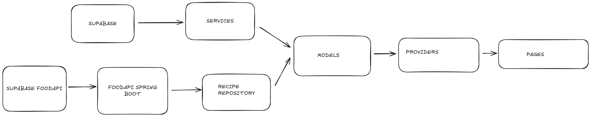

# 🥗 **Dietify: Tu Compañero Integral de Bienestar y Salud**

**Dietify** es una aplicación móvil desarrollada con Flutter, pensada para ayudarte a gestionar todos los aspectos de tu salud y bienestar desde un solo lugar. Esta app actúa como tu asistente personal de fitness, nutrición e hidratación, proporcionando herramientas inteligentes que se adaptan a tu estilo de vida y objetivos.

---

## 📲 **¿Qué es Dietify?**

**Dietify** te permite:

- Registrar y seguir tu **ingesta de macronutrientes**.
- Controlar tu **consumo de agua diario**.
- Monitorizar tu **descanso y calidad del sueño**.
- Acceder a **rutinas de entrenamiento personalizadas**.
- Gestionar tu perfil con **autenticación segura usando Supabase**.
- Compartir y explorar **recetas saludables** dentro de una comunidad.

---

## 🚧 **Tecnologías y Herramientas Utilizadas**

- **Flutter**: Framework principal para el desarrollo multiplataforma.
- **Dart**: Lenguaje de programación utilizado.
- **Supabase**: Backend como servicio para autenticación, base de datos y almacenamiento.
- **Firebase** *(opcional)*: Puede integrarse para notificaciones push o analíticas.
- **Provider / Riverpod** *(según versión)*: Gestión del estado de la app.
- **SharedPreferences / Hive**: Almacenamiento local de datos.
- **REST API**: Comunicación con servicios externos para datos y entrenamientos.

---

## 📂 **Estructura del Proyecto**

A continuación, se detalla la estructura principal del proyecto para facilitar su comprensión:

```
Dietify/
│
├── lib/
│   ├── main.dart                  # Punto de entrada de la app
│   ├── utils/                    # Configuración general (temas, constantes)
│   │   ├── theme.dart
│   ├── models/                    # Clases y modelos de datos (Profile, Recipe, Workout, etc.)
│   │   ├── providers/             # Gestión del estado   
│   ├── services/                  # Lógica de negocio, conexión con API y Supabase
│   ├── pages/                  # Pantallas principales de la app
│   │   ├── home/
│   │   ├── login/
│   │   ├── recipes/
│   │   ├── workout/
│   │   ├── profile/
│   │   ├── workout/
│   │   └── achievement/
│   └── widgets/                  # Widgets reutilizables (botones, tarjetas, etc.)
│
├── assets/
│   ├── images/                   # Imágenes y recursos gráficos
│   └── icons/
```

---

## ⚙️ **Instalación y Ejecución**

Sigue los pasos a continuación para levantar el proyecto en tu entorno local:

1. **Instalar Flutter**  
   Asegúrate de tener el SDK de Flutter instalado. Puedes seguir esta guía:  
   👉 [Instalación de Flutter](https://docs.flutter.dev/get-started/install)

2. **Clonar el Repositorio**  
   Abre tu terminal y ejecuta:
   ```bash
   git clone https://github.com/joseaej/Dietify.git
   cd Dietify
   ```

3. **Obtener las Dependencias**
   ```bash
   flutter pub get
   ```

4. **Correr la Aplicación**
   ```bash
   flutter run
   ```

5. *(Opcional)* Si usas dispositivos físicos o emuladores:
   ```bash
   flutter devices
   flutter run -d <device_id>
   ```

---

## ✨ **Características Destacadas**

### 🍽️ Registro de Macronutrientes
Anota tus comidas diarias y obtén estadísticas detalladas de proteínas, grasas y carbohidratos. Se puede integrar con una base de datos de alimentos o añadir platos manualmente.

### 💧 Seguimiento de Hidratación
Controla el consumo de agua diario con metas personalizadas. Gráficas sencillas te mostrarán tu progreso y consistencia.

### 💤 Monitorización del Sueño
Registra tu tiempo de descanso, horas de sueño profundo, y consulta análisis básicos sobre tu rendimiento de sueño.

### 🏋️‍♂️ Entrenamientos Personalizados
Incluye rutinas clasificadas por nivel (principiante, intermedio, avanzado) y objetivo (fuerza, cardio, pérdida de peso). Puedes guardar tu progreso y marcar favoritos.

### 🔐 Autenticación con Supabase
Sistema de registro e inicio de sesión seguro, incluyendo recuperación de contraseña y persistencia de sesión.

### 👥 Funcionalidades Sociales *(en desarrollo)*
Dietify evolucionará hacia una red social saludable, permitiendo a los usuarios compartir recetas, logros y rutinas.

---

## 🌐 **Entorno de Desarrollo Recomendado**

- **Flutter SDK:** 3.10.0 o superior
- **Dart SDK:** 3.0 o superior
- **VS Code** o **Android Studio** con extensiones de Flutter
- **Dispositivo físico** o **Emulador AVD** con Android 11+

---

## 📷 **Diseño y Prototipo**

Puedes visualizar el diseño general de la app en el siguiente recurso:



También puedes consultar el prototipo interactivo (si se dispone de Figma o similar).

---

## 🤝 **Colaboración**

¿Quieres contribuir a mejorar Dietify? ¡Bienvenido! Sigue estos pasos:

1. **Forkea** el repositorio.
2. Crea una rama nueva:  
   ```bash
   git checkout -b feature/nombre-de-tu-funcionalidad
   ```
3. Realiza tus cambios y haz commit:
   ```bash
   git commit -m "Agrega nueva funcionalidad X"
   ```
4. Sube tus cambios:  
   ```bash
   git push origin feature/nombre-de-tu-funcionalidad
   ```
5. Abre un **Pull Request** en GitHub y describe tu mejora.

---

## 📬 **Contacto y Feedback**

Tu opinión ayuda a mejorar esta aplicación. Si tienes ideas, fallos detectados o quieres colaborar en el proyecto, puedes escribir a:

📧 **armandoespi25@gmail.com**  
🔗 También puedes crear un "Issue" en GitHub para reportar errores o sugerencias.

---

## 👨‍💻 **Autor**

- **José Antonio Espinosa Jiménez**  
  GitHub: [@joseaej](https://github.com/joseaej)
